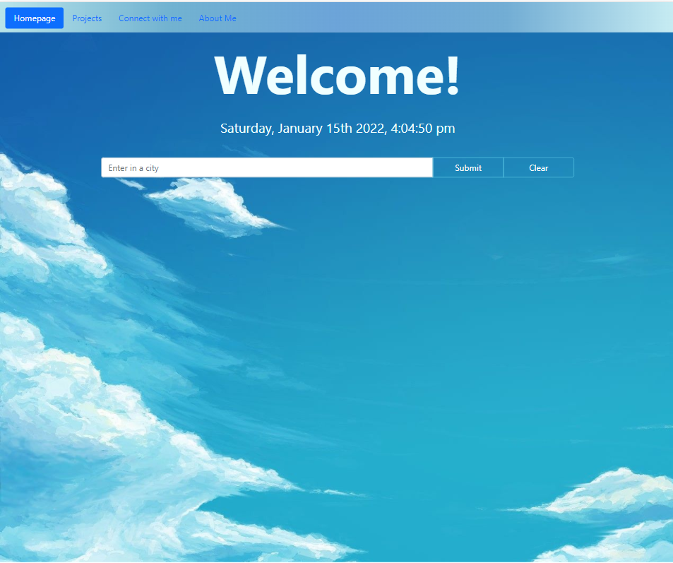
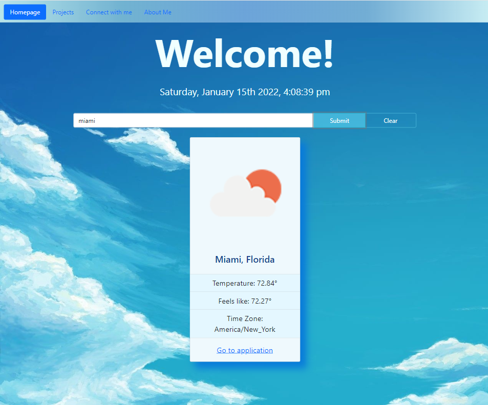
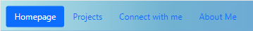
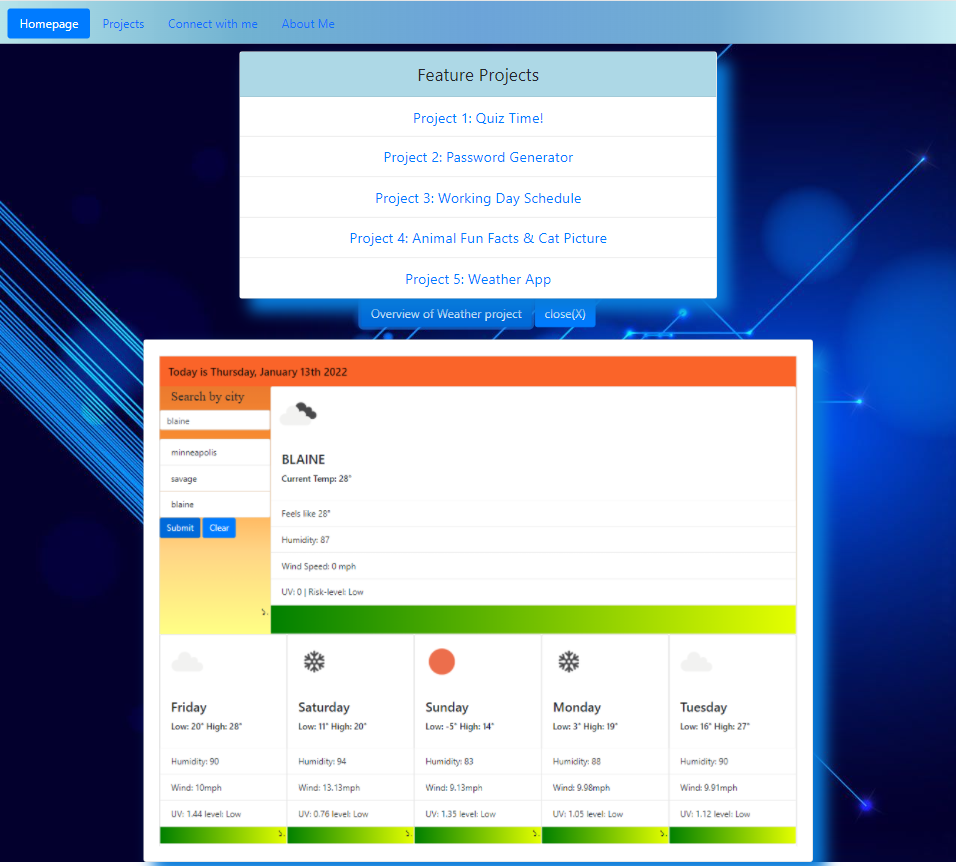
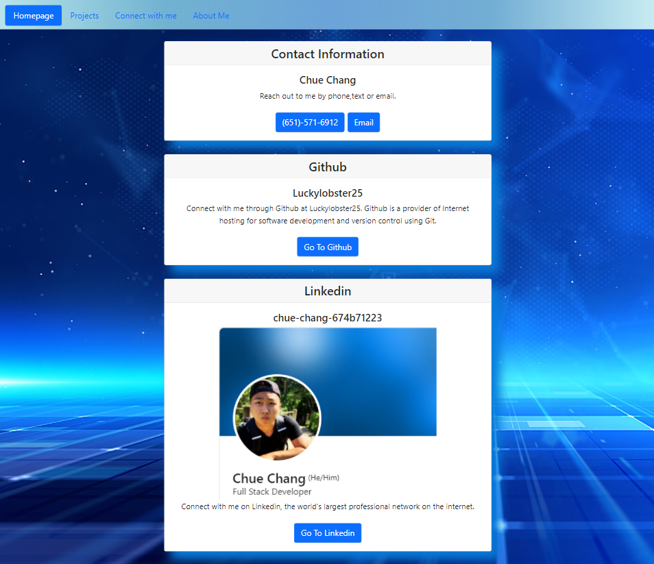
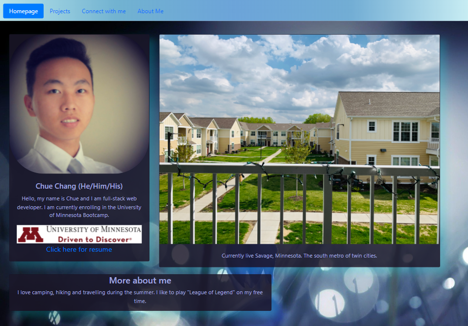

# "My Portfolio" web-page🗺️
## Overview of project: 

This is a portfolio web application of creator. User can interact on webpage with limited imput. Application is mainly created with the purpose of showcasing creator's project and ability use programming languages. 
* Deployment Link: [https://luckylobster25.github.io/My_Portfolio/main](https://luckylobster25.github.io/My_Portfolio/main)
* Tool  used in application: [https://getbootstrap.com/docs/5.1/getting-started/introduction/](https://getbootstrap.com/docs/5.1/getting-started/introduction/)
* Api: [https://openweathermap.org/api](https://openweathermap.org/api)
*********
## Homepage of web application

The project have multiple page and this is the main page or homepage of application. User are welcome with a big "welcome!" text display and a simple weather mini application of city weather. User can enter in a city and a display of the city with it's weather will pop up. 

###
This is the display of weather when a valid city is entered. User can decide to jump to other page using the nav bar on top of web application.  

###
Inside the Nav-bar are "Homepage, Projects, Connect with me, About me" where user can click to display other information. 
## Projects page

Inside the project page, user can click on different link. The link will direct user to the deployment page of each project. Although, a display of the actual weather application is display. It is does not function due to it being only an image for display purpose. User can choose to display or hide image using button above the image. 
## Connect with me page

Here is the display of "connect with me" page. There are buttons to direct user to different website. Email button will open up user's email application which allow user to email the creator. 
## About me page 

This page is mainly about creator. The page allows user to download resume if they choose to do so. 

### Feel free to message me if there is any questions. 
